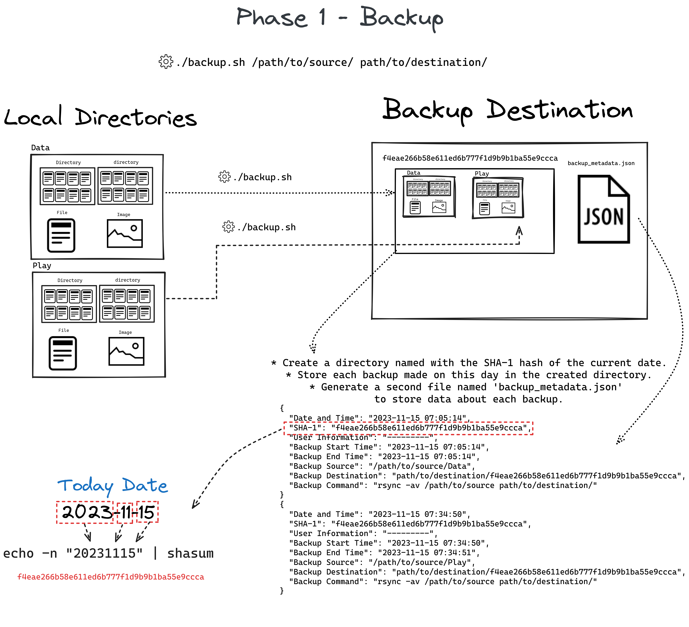
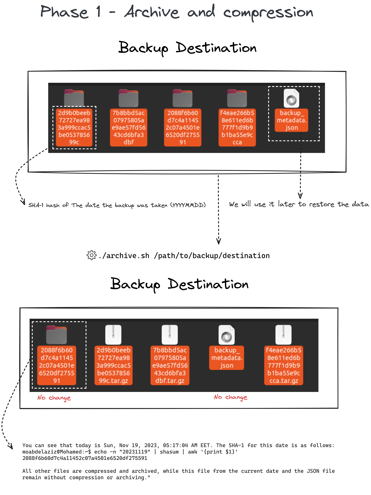
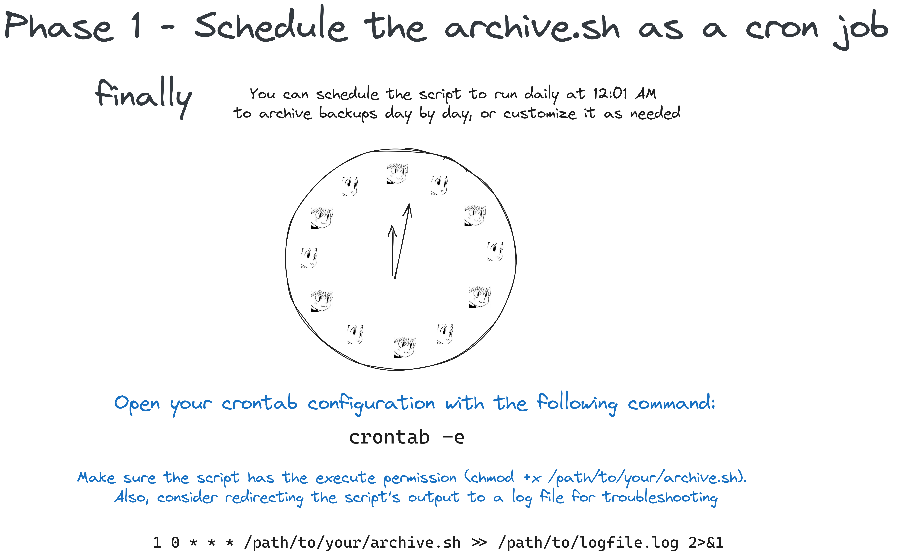
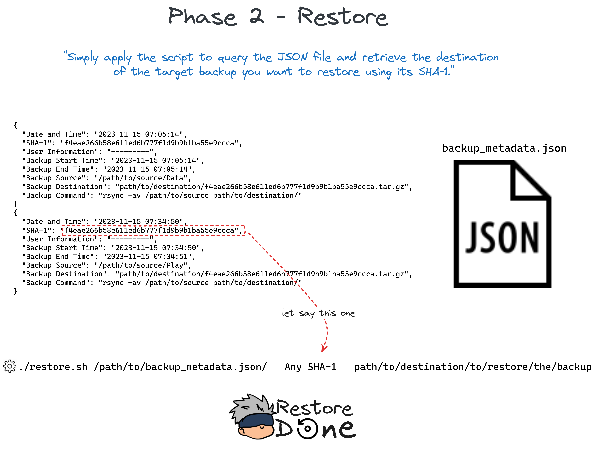

# Secure-BackupRestore
``` Under maintenance```
### Overview 


-  The Secure Backup/Restore Tool performs secure encrypted backups with restore functionality and backups to a remote server. 

### Explanation
- Phase one
  - Backup.
  - Archive and compression.
  - Schedule the ```archive.sh``` as a cron job .
  
---
  
  
---


- You can use [crontab.guru](https://crontab.guru/#*_*_*_*_*) it will be useful.

---

- Phase two
  - Restore.
 
    

---

### Dependencies
- jq (Command-line JSON processor)
    
    - Description: jq is a lightweight and flexible command-line JSON processor. It is used in the script for parsing JSON files.
    - Official Site: [jq Official Site](https://stedolan.github.io/jq/)

    - Installation:
```
    On Ubuntu/Debian: sudo apt-get install jq
    On CentOS/RHEL: sudo yum install jq
    On macOS (via Homebrew): brew install jq
```
- rsync (File synchronization tool):

    - Description: rsync is a fast and versatile file synchronization tool. It is used in the script for performing backups.
    - Official Site: [rsync Official Site](https://rsync.samba.org/)

    - Installation:
```
    On Ubuntu/Debian: sudo apt-get install rsync
    On CentOS/RHEL: sudo yum install rsync
    On macOS (pre-installed, but can be updated using Homebrew): brew install rsync
```
### Next Tasks  
- More customization in the restore module.
- Back up the JSON file containing the metadata of the backups to a remote server.
- Encryption module.
