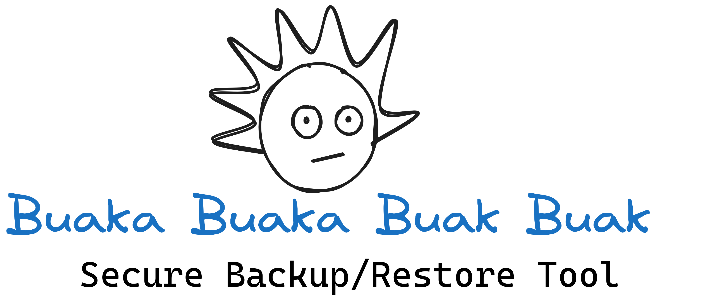

# Secure-BackupRestore

### Overview 



### How to use your backup tool

To use Secure-BackupRestore tool, you have to pass the parameters correctly on the command line which is:

-  4 parameters in the backup case.
    - eg. ```./backup.sh /Secure-BackupRestore/Data /Secure-BackupRestore/Backups MOAEMo 13```
-  3 parameters in the backup case.
    - eg. ``` ./restore.sh /Secure-BackupRestore/Backups/Data /Secure-BackupRestore/Data_Restored MOAEMo```  
- The nitty-gritty details about the parameters were shown in the Drafts folder.

### Structure of the script

-  ```backup_restore_lib.sh``` that includes 7 functions:
  
    - validate_backup_params() {...}
    - Encryption() {...}
    - Decryption() {...}
    - remote_server() {...}
    - backup() {...}
    - validate_restore_params() {...}
    - restore() {...}
    
-  The two scripts ```backup.sh``` and ```restore.sh``` source ```backup_restore_lib.sh``` and invoke the corresponding functions.


### You have to edit the script to fit your needs as follows

- When copying the backup to a remote server, in my case, ```AWS EC2 instance```.
- so you have to set up yours in this part.
- eg. ```scp -i EC2Naruto.pem ${backup} ubuntu@ec2-54-197-112-106.compute-1.amazonaws.com:backup```
- If you want to take a backup of a particular directory, regardless of the backup of the changed files during the last n days only. use this code in ```buckup()``` function.
     ```bash
    # get the directory to be backed up to the backup area.
    cp -r ${TargetDir} ${TargetBackup}

    # A new path directory to be backed up in the backup area.
    data=${TargetBackup}/$(basename $TargetDir)
    cd ${data}
    files=$(ls ${data})
     ```


### Finally 

- Data directory, my own directory, I want to backup. It is yours to backup any directory on your machine.
- Setting up GPG in your machine.
- The nitty-gritty details about each process were shown in the Drafts folder.
- Under improvement.
- Feel free to contribute, Have fun:).
